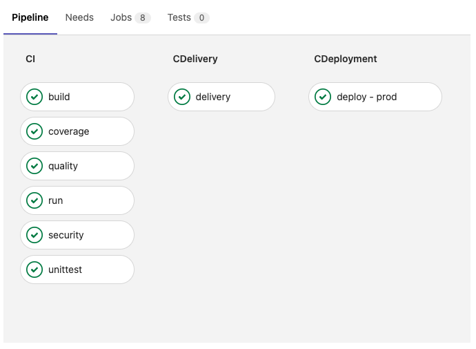
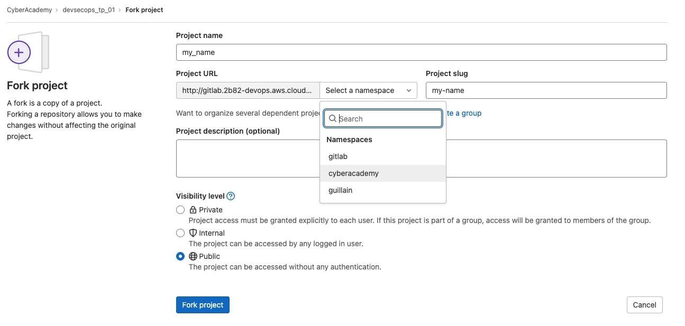

# DevSecOps Module - TP 01

---

- Leader: Guillain Sanchez
- Volume: 1h30
- 100% on site
- Course: 0%
- Labs/HandOn: 100%

---

- [Presentation](#Presentation)
  - [The application to check, to build and to deliver](#The_application_to_check,_to_build_and_to_deliver) 
  - [CI/CD pipeline](#CI/CD pipeline)
- [PreRequisite](#PreRequisite)
  - [Create your own repository on Gitlab](#Create your own repository on Gitlab)
  - [Create your local environment](#Create your local environment)
- [Run the pipeline](#Run the pipeline)
- [Run the tests by CLI](#Run the tests by CLI)
- [Add change](#Add change)
  - [Story](#Story)
  - [Guideline](#Guideline)

---

## Presentation

### The application to check, to build and to deliver

It's Python Flask application, the one used during the Python courses.

You can find the following information about it:

- Source code: https://gitlab.2b82-devops.aws.cloud.airbus-v.corp/cyberacademy/devsecops_tp_01/-/tree/main/src
- Tests: https://gitlab.2b82-devops.aws.cloud.airbus-v.corp/cyberacademy/devsecops_tp_01/-/tree/main/tests

### CI/CD pipeline

It's a simple pipeline for Python code running on gitlab-ci environment.

- https://gitlab.2b82-devops.aws.cloud.airbus-v.corp/cyberacademy/devsecops_tp_01/-/pipelines

The pipeline covers the following steps:

- 

---

## PreRequisite

### Create your own repository on Gitlab

Fork the _[devsecops_tp_01](https://gitlab.2b82-devops.aws.cloud.airbus-v.corp/cyberacademy/devsecops_tp_01)_ repository as explained in the screenshot:

- https://gitlab.2b82-devops.aws.cloud.airbus-v.corp/cyberacademy/devsecops_tp_01
- 

You don't need to do other thing. 
The **runners**, which are the **agents which process the pipeline**, are already setup to take the load.

### Create your local environment

It's always useful to have the repository locally for the development of the application or the pipeline.

Follow the next steps to set up it to have a working application and the environment of test. 

1. Clone your own repository from Gitlab to your computer
   - `git clone https://gitlab.2b82-devops.aws.cloud.airbus-v.corp/cyberacademy/[MY-NAME]`
2. Jump in the new folder
   - `cd [MY-NAME]`
3. Set up the Python virtual environment
   - `python3 -m venv .env`
4. Active the Python virtual environment
   - `source .env/bin/activate`
5. Install Python application requirements
   - `pip install -r requirements.txt`
6. Install Python CI/CD requirements
   - `pip install pytest pylint coverage bandit build`

---

## Run the pipeline

Jump on the **CI/CD** menu of GitLab to access to the **Pipelines** screen.

Starting from a new repository, nothing is shown because no pipeline has been executed.

So it's time to run it!

Click on **Run pipeline** on the top right of the **Pipelines** screen.

A menu is displayed to:
- select the branch of the repository. Stay on the _main_ branch
- add variables in case of pipeline's needs. We keep it empty.

Click again on the button **Run pipeline**.

---

## Run the tests by CLI

What has been done in the pipeline?
To understand it we'll do it manually on the local environment.

To do for each pipeline's step:

1. Discover the commands which were executed in the pipeline define in the [.gitlab-ci.yml](.gitlab-ci.yml) file
2. Execute the command
3. Analyse the result/file

---

## Add change

Now it's time to do your own change!
And as we're a DevOps team member we use the standard of the development.

### Story

The PO has created a new task in the backlog.
The pipeline must also deploy the application in a new environment named **validation**.
This deployment must be done before the one in production.

### Guideline

1. In your local environment
   1. Create a new branch and use it
      1. `git checkout -B add-val-env`
   2. Modify the existing pipeline to include the new feature
      1. _up to you to write this new step_
   3. Commit your change
      1. `git add [FILES]` # add the files which have been modified
      2. `git commit -am'[SUMARY OF THE CHANGE]`
      3. `git push`
2. In Gitlab
   1. Check the result of the pipeline
      1. https://gitlab.2b82-devops.aws.cloud.airbus-v.corp/cyberacademy/[MY-NAME]/-/pipelines
   2. What's happen for the _CDeployment_ step?
   3. If it's a success, create a **Merge request** and **add the teachers** as **Reviewer**
      1. https://gitlab.2b82-devops.aws.cloud.airbus-v.corp/cyberacademy/[MY-NAME]/-/merge_requests/new
   4. What's happen for the _CDeployment_ step?
         1. Explain in the comment of the **Merge request** the behaviour

---

